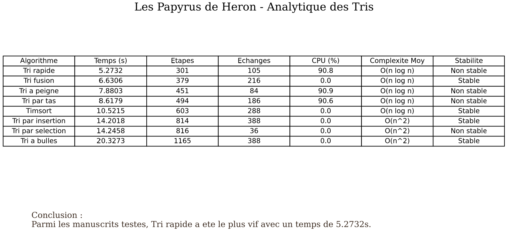

# Algorithmes de Tri - Les Papyrus de Heron

## Contexte du projet

Ce projet a pour but d'implementer, de comparer et d'analyser les performances de plusieurs algorithmes de tri. En nous glissant dans la peau d'un developpeur aidant le celebre mathematicien Heron d'Alexandrie, nous avons developpe un outil complet permettant a la fois une analyse mathematique rigoureuse en console (benchmarking) et une visualisation educative via une interface graphique interactive.

Le projet inclut l'etude de 8 algorithmes :
- Tri par selection
- Tri a bulles
- Tri par insertion
- Tri fusion
- Tri rapide (Quick sort)
- Tri par tas (Heap sort)
- Tri a peigne (Comb sort)
- Timsort

## Structure du Repository

- `sorting.py` : Contient l'implementation pure de tous les algorithmes de tri.
- `display.py` : Gere l'interface graphique interactive, le multithreading, la recolte des metriques et la generation des exports (CSV/PDF).
- `main.py` : Point d'entree du programme permettant de coordonner l'execution avec differents arguments en ligne de commande.
- `requirements.txt` : Liste des dependances necessaires au bon fonctionnement du projet.

## Installation et Utilisation

Il est fortement recommande d'utiliser un environnement virtuel (Python 3.9+). Voici les instructions selon votre configuration et votre systeme d'exploitation.

### Option 1 : Avec l'environnement standard Python (venv)

**Sous Windows :**
```cmd
python -m venv sorting_env
sorting_env\Scripts\activate
pip install -r requirements.txt
```

**Sous macOS et Linux :**
```bash
python3 -m venv sorting_env
source sorting_env/bin/activate
pip3 install -r requirements.txt
```

### Option 2 : Avec Anaconda (Tous OS)

```bash
conda create -n sorting_env python=3.10 -y
conda activate sorting_env
pip install -r requirements.txt
```

### Lancement de l'application

Une fois l'environnement active et les dependances installees, vous pouvez executer le projet depuis la racine du dossier :

1. Lancer l'interface graphique avec tous les algorithmes en parallele :
    ```bash
    python main.py --algo all --gui --threads
    ```
    *(Note : Sur macOS/Linux, utilisez `python3` au lieu de `python` si necessaire).*

2. Lancer le mode benchmark pur (sans interface) pour mesurer les temps CPU exacts en console :
    ```bash
    python main.py --algo all --bench
    ```

## L'Interface Graphique : Les Papyrus de Heron

Afin d'apporter un aspect visuel a l'efficacite des algorithmes de tri, une interface a ete developpee en utilisant Pygame. Nous avons choisi un theme esthetique inspire de l'Egypte antique en l'honneur d'Heron d'Alexandrie :

- Le Design (Glassmorphism) : Les couleurs rappellent les materiaux historiques de l'Egypte. Le Papyrus pour les textes, le Lapis-lazuli pour les barres au repos, la Cornaline (rouge/orange) pour les elements en cours de comparaison ou d'echange, et l'Or pour les elements definitivement tries.
- L'Audio : Des retours sonores se declenchent dynamiquement lors des echanges et a la fin des tris.
- Le Multithreading : Chaque algorithme s'execute sur son propre thread de maniere asynchrone, permettant d'observer une veritable "course" en temps reel sans bloquer le rendu de la fenetre principale.
- Rapports d'Analyse : A la fin de l'execution, un tableau recapitulatif permet de visualiser les performances (Temps, Etapes, CPU, Complexite). Ces donnees peuvent etre exportees en PDF ou CSV dans le dossier `rapports_analyse/`.

## Analyse des Algorithmes et Concepts Cles

### 1. La Stabilite d'un Tri
Un algorithme de tri est dit "stable" s'il preserve l'ordre initial des elements possedant la meme valeur. 
Par exemple, si nous trions des eleves par note, et qu'Alice (15/20) apparait avant Charlie (15/20) dans la liste initiale, un tri stable (comme Timsort ou le Tri par insertion) garantira qu'Alice restera devant Charlie a la fin. Un tri instable (comme le Tri rapide ou par selection) pourrait inverser leurs positions. C'est une notion cruciale lors du tri de bases de donnees complexes sur de multiples criteres.

### 2. Le Biais Visuel de l'Interface Graphique
Dans une interface visuelle, l'animation necessite d'introduire des pauses artificielles (`time.sleep`) pour laisser le temps a l'oeil humain de voir les echanges et les comparaisons. Un algorithme faisant peu d'echanges mais beaucoup de comparaisons pourrait sembler artificiellement rapide si seules les actions visuelles sont chronometrees.
Pour pallier ce biais, notre moteur d'analyse soustrait mathematiquement le temps de pause de l'interface graphique du chronometre final. Le temps affiche sur nos rapports correspond strictement au temps de calcul effectif du processeur.

## Conclusion Objective

A l'issue de nos benchmarks, nous pouvons conclure qu'il n'existe pas d'algorithme "parfait" universel, mais plutot des algorithmes adaptes a des contextes specifiques :

- Le choix optimal global (Le Vainqueur) : Le Timsort. Il est le plus polyvalent. Etant adaptatif, il exploite les donnees deja partiellement triees (tres frequentes dans le monde reel) pour tomber a une complexite de O(n). C'est pourquoi il est nativement utilise par Python et Java.
- La vitesse brute : Le Tri rapide (Quick Sort). Sur des donnees totalement aleatoires, il bat tres souvent les autres grace a son excellente "localite de cache", qui optimise la facon dont le processeur lit la memoire RAM.
- L'environnement contraint : Le Tri par tas (Heap Sort). Contrairement au Timsort ou au Tri Fusion qui necessitent de la memoire supplementaire (O(n)), le Tri par tas maintient une complexite en temps de O(n log n) tout en ayant une complexite spatiale de O(1). Il est indispensable pour les systemes embarques avec tres peu de memoire.
- Les petites listes : Le Tri par insertion. Sa simplicite le rend extremement rapide sur de tres petites quantites de donnees, au point que des algorithmes avances comme Timsort l'utilisent en sous-routine.

## Apercu des Resultats


